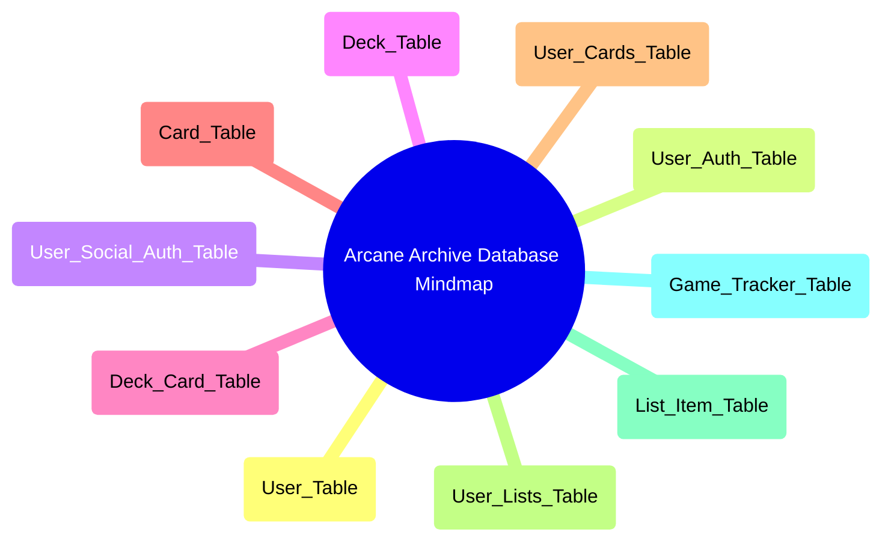
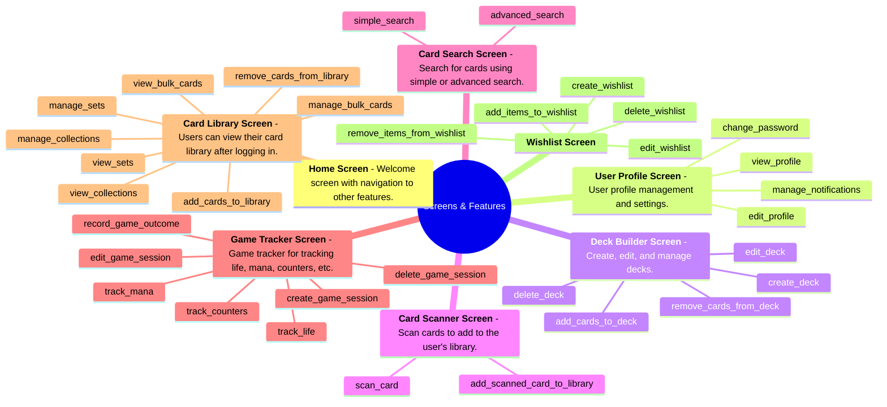
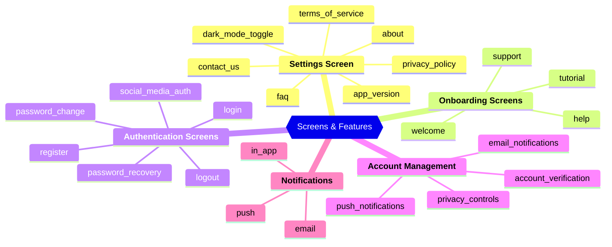

```mermaid
---
config:
  theme: elk
  mindmap:
    defaultRenderer: elk
    curve: curve
    htmlLabels: true
---
mindmap
  root((Arcane Archive Database Mindmap))
        (User_Table)
        (User_Auth_Table)
        (User_Social_Auth_Table)
        (Deck_Table)
        (Deck_Card_Table)
        (Card_Table)
        (User_Cards_Table)
        (User_Lists_Table)
        (List_Item_Table)
        (Game_Tracker_Table)
```

```mermaid
mindmap
    root((Screens & Features))
        **Home Screen** - Welcome screen with navigation to other features.
        **User Profile Screen** - User profile management and settings.
            view_profile
            edit_profile
            change_password
            manage_notifications
        **Deck Builder Screen** - Create, edit, and manage decks.
            create_deck
            edit_deck
            delete_deck
            add_cards_to_deck
            remove_cards_from_deck
        **Card Scanner Screen** - Scan cards to add to the user's library.
            scan_card
            add_scanned_card_to_library
        **Card Search Screen** - Search for cards using simple or advanced search.
            simple_search
            advanced_search
        **Game Tracker Screen** - Game tracker for tracking life, mana, counters, etc.
            create_game_session
            edit_game_session
            delete_game_session
            track_life
            track_mana
            track_counters
            record_game_outcome
        **Card Library Screen** - Users can view their card library after logging in.
            view_collections
            manage_collections
            view_sets
            manage_sets
            view_bulk_cards
            manage_bulk_cards
            add_cards_to_library
            remove_cards_from_library
        **Wishlist Screen**
            create_wishlist
            edit_wishlist
            delete_wishlist
            add_items_to_wishlist
            remove_items_from_wishlist
```

```mermaid
mindmap
    root{{Screens & Features}}
        **Settings Screen**
            privacy_policy
            terms_of_service
            contact_us
            about
            faq
            app_version
            dark_mode_toggle
        **Onboarding Screens**
            welcome
            tutorial
            help
            support
        **Authentication Screens**
            register
            login
            logout
            password_recovery
            social_media_auth
            password_change
        **Account Management**
            account_verification
            email_notifications
            push_notifications
            privacy_controls
        **Notifications**
            email
            push
            in_app
```